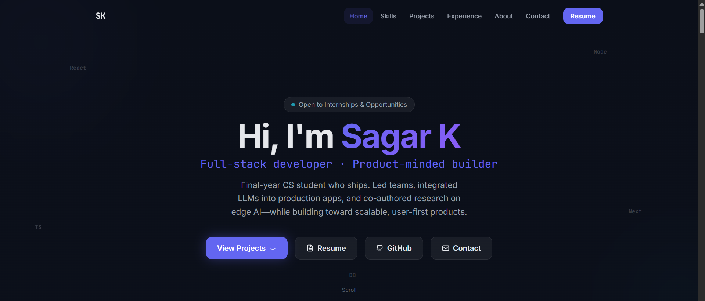
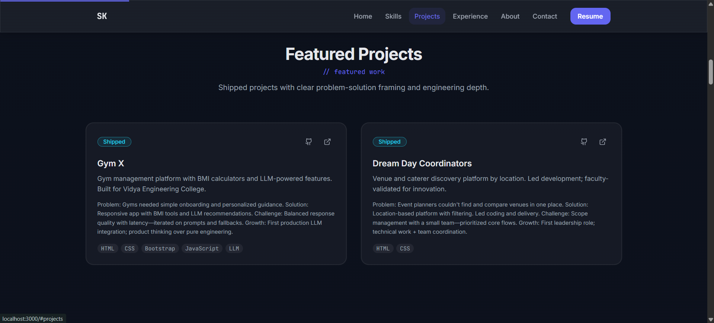
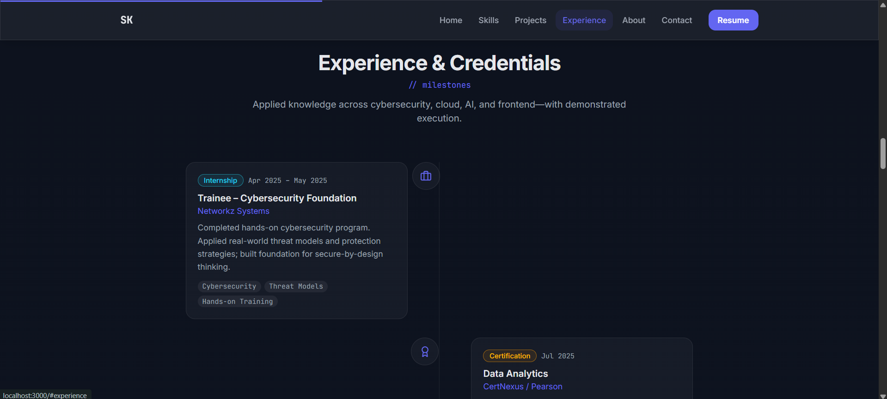

# Sagar K — Full-Stack Developer Portfolio

Production-ready portfolio built with Next.js, TypeScript, and a system-driven animation architecture.

🔗 Live: https://your-vercel-link.vercel.app  
💻 Repository: https://github.com/sagarzaz/sagar-portfolio

---

## About This Project

This portfolio showcases my approach to frontend architecture, motion design, and scalable component systems.

Instead of decorative animations, I implemented a structured motion system that:

- Supports visual hierarchy
- Guides user attention intentionally
- Maintains performance
- Ensures accessibility and responsiveness

---

## Tech Stack

**Frontend**
- Next.js (App Router)
- TypeScript
- Tailwind CSS
- Framer Motion

**Architecture**
- Modular component structure
- Reusable motion primitives
- Custom hooks for animation & responsiveness

**Deployment**
- GitHub
- Vercel (CI/CD)

---

## Screenshots

### Hero Section

### Projects Section

### Experience Section

---

## Project Structure

app/ — App Router pages  
components/ — UI & motion components  
hooks/ — Custom logic  
lib/ — Utilities  
public/ — Static assets  

---

## Getting Started

Clone the repository:

git clone https://github.com/sagarzaz/sagar-portfolio.git  
cd sagar-portfolio  
npm install  
npm run dev  

Build for production:

npm run build  
npm start  

---

## Future Improvements

- Blog integration
- Performance audit (Lighthouse 95+)
- Expanded case studies
- Enhanced SEO metadata

---

Built with intent. Refined through iteration.